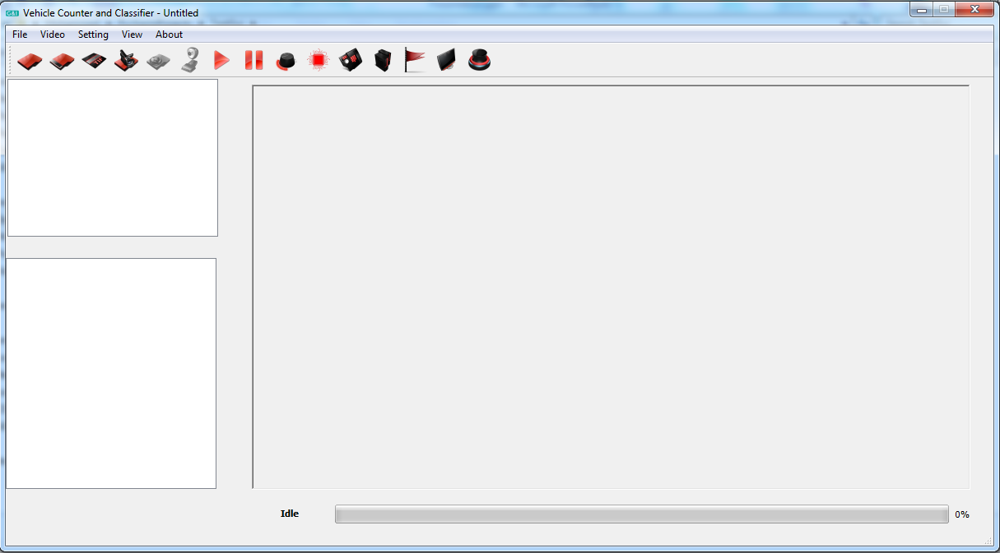
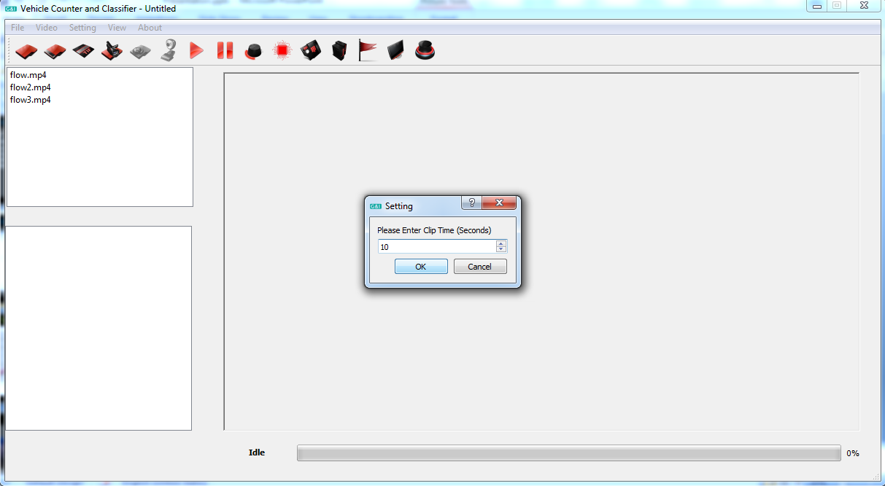
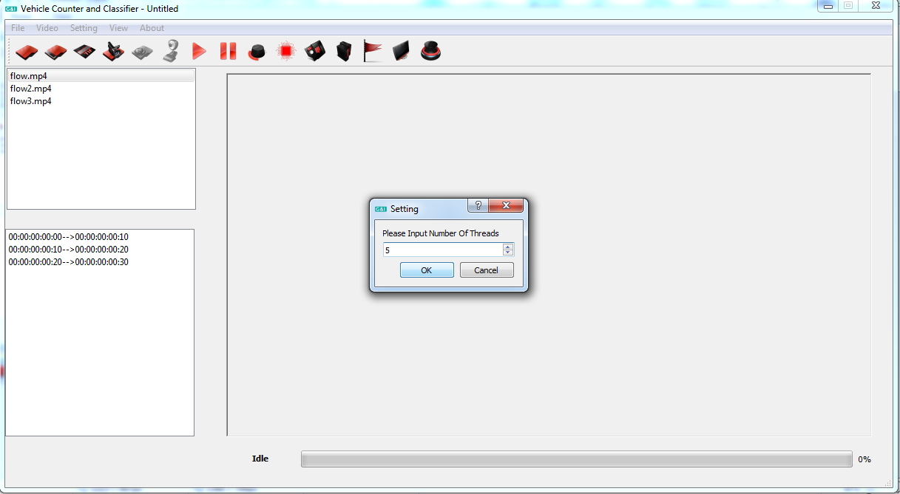
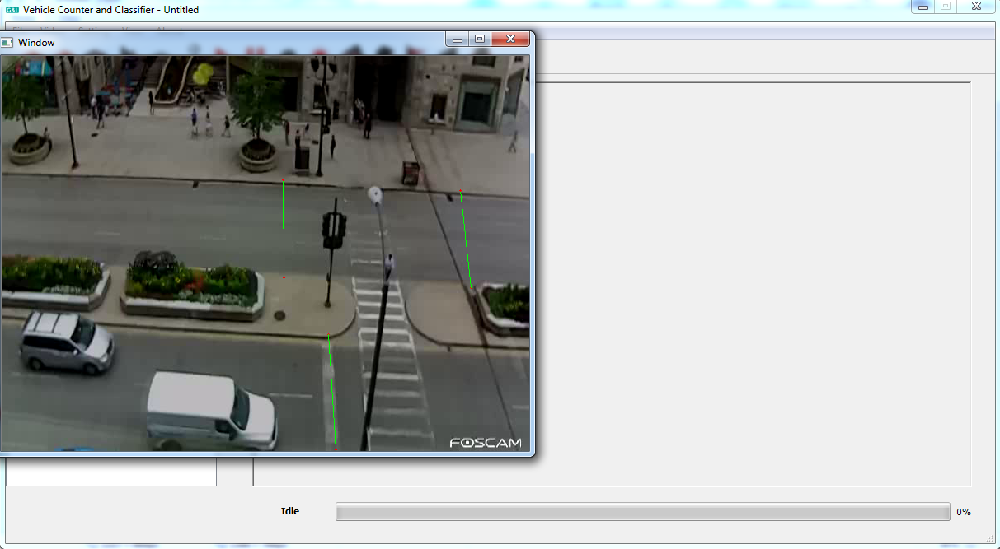
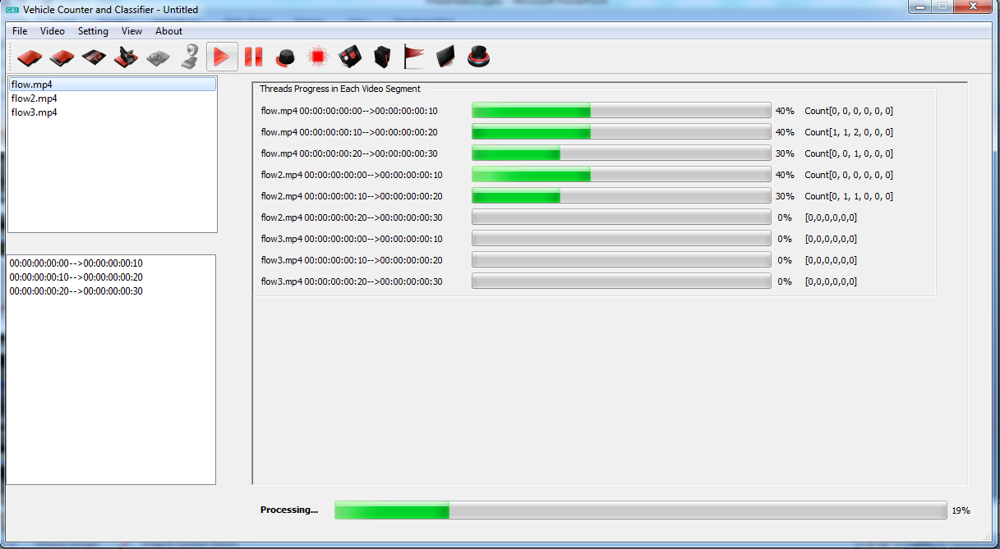
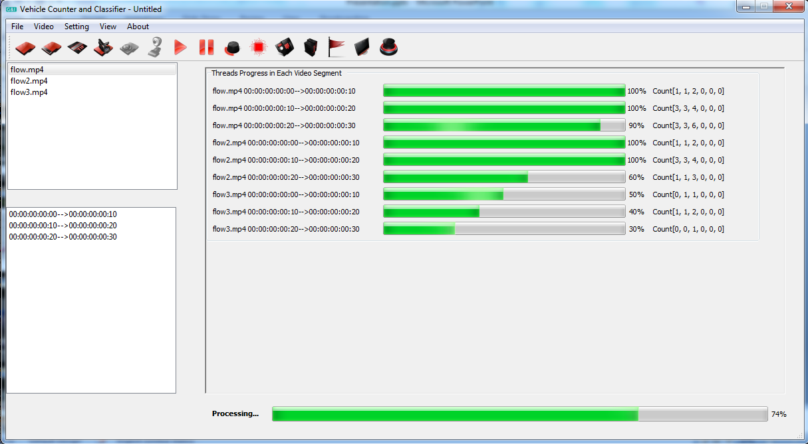
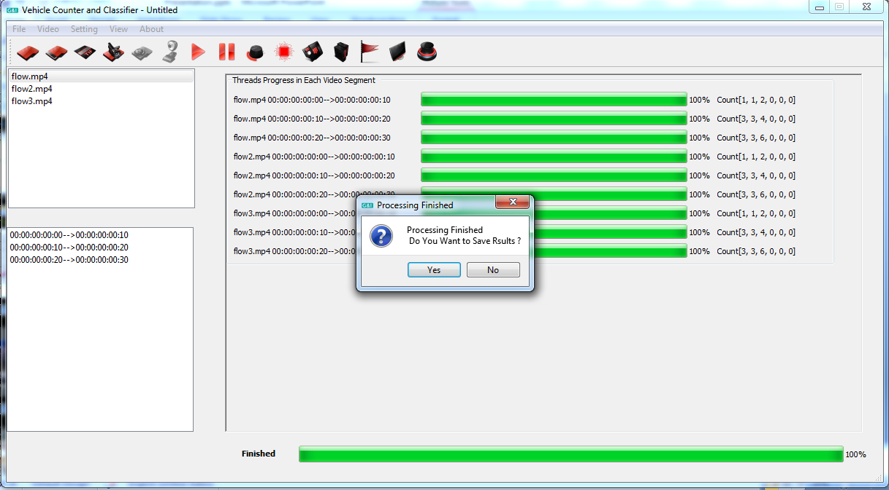
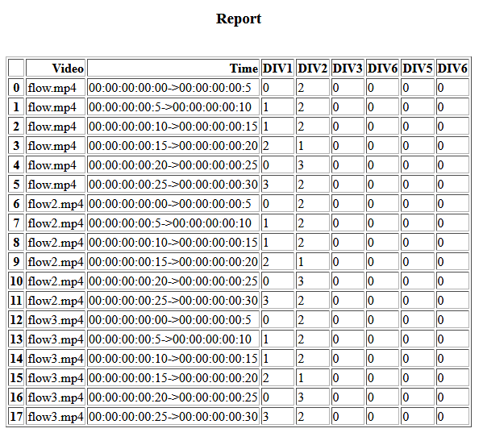

# VehiclCounterAndClassifierGUI
This project purpose is to make GUI software that implement the process of vehicle counting and classification,
### Features
- Video Cropping to Sub Videos
- Deep Learning (CNN) Classification
- Multi-threading support
- Multiple Counting Lines (up to 6)
- Reporting as CSV and HTML
### To Do
- Full documentation
- Online streaming support
- Performance optimization
- Automatic parameters detection 

### Tested on windows, python 3.5.2
## Install 
```
git clone https://github.com/momaabna/VehiclCounterAndClassifierGUI
cd VehiclCounterAndClassifierGUI
pip install requrenments.txt
```
or just use binary release from <a href='https://github.com/momaabna/VehiclCounterAndClassifierGUI/releases'>here</a>.
## Usage 
```
python3 main.py

```


## screenshots


<table>
  <tr>
    <td> </td>
     <td> </td>
     <td> </td>
  </tr>
  <tr>
    <td></td>
    <td></td>
    <td></td>
  </tr>
   <tr>
    <td></td>
    <td></td>
    <td></td>
  </tr>
   <tr>
    <td></td>
    <td></td>
    <td> </td>
  </tr>
 </table>

### Classification model 

The classification model (VGG16) was trained on part of  <a href='https://podoce.dinf.usherbrooke.ca/challenge/dataset/'> classification challenge dataset </a> and test accuracy was 74% , you can train your own model. 
Trained model can be found in url  :

https://drive.google.com/file/d/1vHjXBYNpczQ-9UMGR5rEFjXsWLqpsznK/view?usp=sharing
### References

https://github.com/NationalAssociationOfRealtors/VehicleCounting


Not fully documented but you can easily run it.
